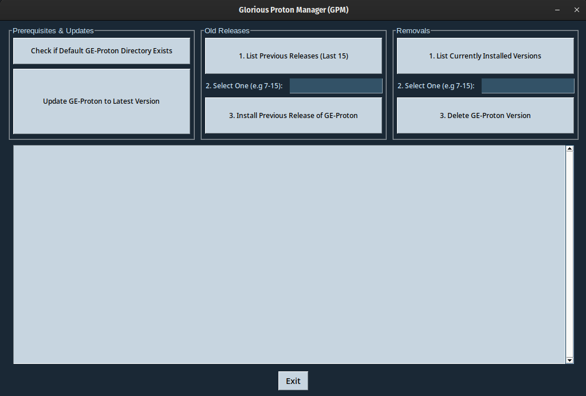

Introduction
------------
**Glorious Proton Manager (GPM)** is a tool that allows Linux users to delete and install old and new releases of [Proton-GE][ge-proton-url] as they come out. Giving a UI for this felt needed as the number of new users gaming on Linux is growing thanks to Valve, Wine and other open source projects.

[ge-proton-url]: https://github.com/GloriousEggroll/proton-ge-custom



Dependencies
------------
GPM needs python3-tkinter (Fedora)/python3-tk (Ubuntu or openSUSE Leap). You can install it with the command:
```bash
Fedora:
sudo dnf install python3-tkinter
```
```bash
Ubuntu:
sudo apt install python3-tk
```
```bash
openSUSE Leap:
sudo zypper in python3-tk
```

Installation
------------
## From source
You can clone the repository with the command:
```bash
git clone https://github.com/thelocomotion/GloriousProtonManager.git
```

Once the repository is cloned, you can enter the directory and run:
```bash
pip3 install -r requirements.txt
```
It will install the needed Python modules to run GPM.

## Using pip
```
pip3 install GloriousProtonManager
```
Locate gpm.py and then run:
```
chmod +x gpm.py
./gpm.py
```

Usage
------------
To run GPM type:
```bash
./gpm.py
```

What you can do with this tool
------------------------------
GPM is divided into 3 different columns: **Prerequisites and Updates**, **Old releases** and **Removals**.

## Prerequisites
This button checks if the default directory **(~/.steam/root/compatibilitytools.d)** where Proton-GE releases should be installed exists. It will be created if it does not.

## Updates
This button checks if the last version of Proton-GE is installed on your system. A message saying so will be shown if it is. Otherwise it will be installed.

## Old releases
This column is divided into 3 different steps, which the user should follow in order. First list the releases, then select one from the list by typing its version and lastly press the Install button. I decided to show only the last 15 releases as anything older felt irrelevant. It will say so with a popup warning message if the field is left empty or an invalid value is given.

## Removals
Another 3 step column. Works the same way as the other menu. It checks which releases are installed and allows you to delete them once the version value is given as input. It will also show a popup warning message if the field is left empty or an invalid value is given.

Known bugs
------------
Other than improving the code, there are 2 bugs that I am currently working on:

- The "Installing" message is not shown until the installation is done during the install process, so it might look like tit is stuck. Just let it run. I would like to eventually add a progress bar or something to show the process better.

- Making the interface look the same across distinct platforms and distros is a challenge with PySimpleGUI. It will look good in Fedora, but it might look mildly off in distros like Ubuntu or OpenSUSE.
