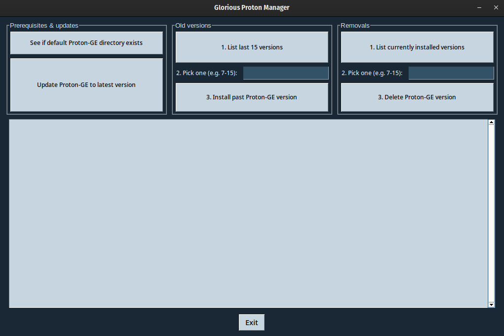

# Glorious Proton Manager
A tool that allows Linux users to delete & install old & new [Proton-GE](https://github.com/GloriousEggroll/proton-ge-custom) versions as they come out. Making a GUI for it felt needed, as the number of Linux gamers is growing thanks to Valve, Wine & other open source projects.


## Installation
### Dependencies
It needs python3-tkinter (Fedora)/python3-tk (Ubuntu & openSUSE Leap). To install it, run:
#### Fedora
```
sudo dnf install python3-tkinter
```
#### openSUSE Leap
```
sudo zypper in python3-tk
```
#### Ubuntu
```
sudo apt install python3-tk
```
### From source
To clone the repository, run:
```
git clone https://github.com/thelocomotion/GloriousProtonManager.git
```
Open the directory once the repository is cloned & run:
```
pip3 install -r requirements.txt
```
It will install the needed Python modules to run it.
### Using pip
```
pip3 install GloriousProtonManager
```
Locate gpm.py & run:
```
chmod +x gpm.py
./gpm.py
```
## Usage
To run it, type:
```bash
./gpm.py
```
## Features
It is split into 3 columns: **Prerequisites & updates**, **Old versions** & **Removals**.
### Prerequisites
Sees if the default directory **(~/.steam/root/compatibilitytools.d)** where Proton-GE versions should be installed exists. Creates it if it does not.
### Updates
Sees if the latest Proton-GE version is installed on your system. Shows a message saying so if it is. Installs it if it is not.
### Old versions
Split into 3 steps, which should be followed in order:
1. List the versions.
2. Pick one from the list by typing its version.
3. Click on the Install button.

I decided to show only the last 15 versions, as older versions felt pointless. It will show a popup warning message if the field is left empty or an invalid value is given.
### Removals
Sees which versions are installed. Allows you to delete them once the version value is given as input. Works the same way as the other menu. Also shows a popup warning message if the field is left empty or an invalid value is given.
## Known bugs
- Making the GUI look identical across platforms & distros is hard with PySimpleGUI. It will look fine on Fedora, but may look a bit off on distros like Ubuntu or OpenSUSE.
