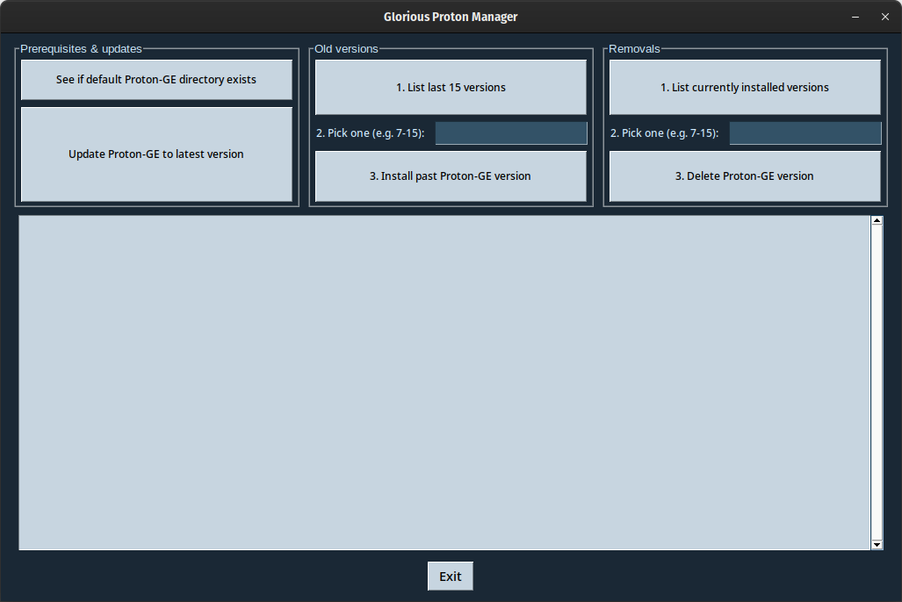

# Glorious Proton Manager
A simple (and glorious!) Proton-GE manager.

Glorious Proton Manager allows Linux users to delete and install old and new [Proton-GE](https://github.com/GloriousEggroll/proton-ge-custom) versions as they come out. Making a GUI for it felt needed; the number of Linux gamers is growing thanks to Valve, Wine and other open source projects.



## Installation

### Dependencies
The only dependency is `tkinter`. To install it, run:

#### Arch/Manjaro
```
sudo pacman -S tk
```

#### Fedora
```
sudo dnf install python3-tkinter
```

#### openSUSE Leap
```
sudo zypper in python3-tk
```

#### Ubuntu
```
sudo apt install python3-tk
```

### With pip
```
pip3 install GloriousProtonManager
```

## Usage
`GloriousProtonManager` will be added to `~/.local/bin/` after installation. To run it, type:
```bash
~/.local/bin/GloriousProtonManager
```

## Features
GPM is split into 3 columns: **Old versions**, **Prerequisites and updates** and **Removals**.

### Old versions
Old versions is split into 3 steps, which should be followed in order:
1. List the versions.
2. Pick one from the list by typing its version.
3. Click on the Install button.

### Prerequisites and updates
Prerequisites sees if the default `~/.steam/root/compatibilitytools.d` directory where Proton-GE versions should be installed exists and creates it if it does not.

Updates sees if the latest Proton-GE version is installed on the system and shows a message saying so if it is, installing it if it is not.

I decided to show only the last 15 versions; older versions felt unneeded. GPM shows a popup warning message if the field is left empty or an invalid value is given.

### Removals
Removals sees which versions are installed and allows their removal once the version value is given as input and works the same way as the other menu, also showing a popup warning message if the field is left empty or an invalid value is given.

## Known bugs
- Making the GUI look the same across platforms and distros is hard with PySimpleGUI. It will look fine on Fedora and Manjaro, but it may look a bit off on distros like openSUSE or Ubuntu.
- The **Exit** button has to be pressed twice to close GPM.
